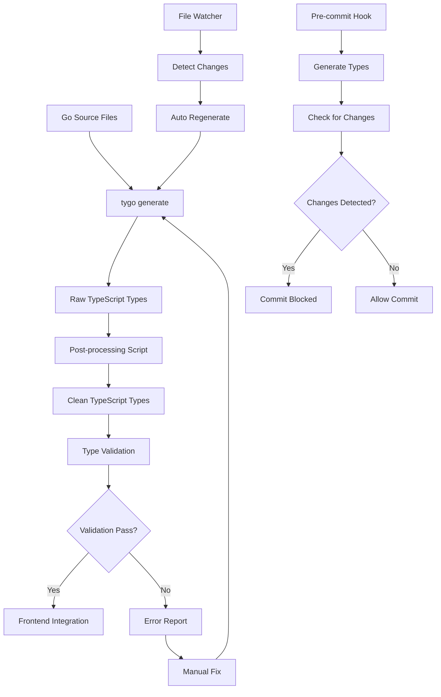

# Backend-to-Frontend Type Generation Workflow

## Overview

This document describes the automated type generation workflow that synchronizes TypeScript type definitions with Go backend models, ensuring type safety across the full-stack application.

### System Architecture Context

```
┌─────────────────┐    ┌──────────────────┐    ┌─────────────────┐
│   Go Backend    │    │   Type Generator │    │ TypeScript      │
│                 │    │                  │    │ Frontend        │
│ • Models        │───▶│ • tygo           │───▶│ • Generated     │
│ • Shared Types  │    │ • Post-processing│    │   Types         │
│ • API Responses │    │ • Validation     │    │ • Type Safety   │
└─────────────────┘    └──────────────────┘    └─────────────────┘
```

### Purpose of Type Generation

- **Type Safety**: Eliminate runtime type mismatches between backend and frontend
- **Developer Experience**: Provide IntelliSense and compile-time validation
- **API Contract**: Maintain single source of truth for data structures
- **Consistency**: Ensure shared constants and enums are synchronized

### Key Components

- **tygo**: Go-to-TypeScript type generator
- **Post-processing Scripts**: Type cleanup and import fixing
- **Build Integration**: Automated type generation in development workflow
- **Validation**: Type generation testing and verification

## Implementation Steps

### a) Backend Type Extraction

**Input Sources:**

- Go structs with `// tygo:emit` comments
- Shared constants and enums
- API request/response types

**Configuration (tygo.yaml):**

```yaml
packages:
  # Shared constants and types
  - path: "user_onboarding/shared"
    output_path: "client/src/types/generated/shared.ts"
    type_mappings:
      time.Time: "string"
      uuid.UUID: "string"
      json.RawMessage: "Record<string, unknown>"
      gorm.DeletedAt: "string | null"
    style_options:
      enum_style: "union"

  # Internal models
  - path: "user_onboarding/internal/models"
    output_path: "client/src/types/generated/models.ts"
    frontmatter: |
      import type { UserRole, PaymentStatus, PaymentMethod, MaritalStatus } from './shared';

  # API Response Types
  - path: "user_onboarding/internal/types"
    output_path: "client/src/types/generated/api.ts"
    frontmatter: |
      import type { UserRole, PaymentStatus, PaymentMethod, MaritalStatus, Permission } from './shared';
      import type { Hospital, User, Patient, Address, Payment, PatientOpData, UserHospitalRole, UHIDCounter, AuditTrail } from './models';
```

**Go Source Example:**

```go
// tygo:emit
type UserRole string

const (
    UserRoleSuperAdmin   UserRole = "super_admin"
    UserRoleAdmin        UserRole = "admin"
    UserRoleReceptionist UserRole = "receptionist"
)

// tygo:emit
type User struct {
    BaseModel
    UserName      string             `gorm:"not null" json:"userName"`
    Email         string             `gorm:"uniqueIndex;not null" json:"email"`
    Phone         string             `gorm:"uniqueIndex;not null;size:15;index" json:"phone"`
    Password      string             `gorm:"not null" json:"-"`
    Metadata      json.RawMessage    `gorm:"type:jsonb" json:"metadata"`
    HospitalRoles []UserHospitalRole `gorm:"foreignKey:UserID" json:"hospitalRoles"`
}
```

### b) Type Transformation Process

**Primary Generation:**

```bash
# Install tygo if not present
go install github.com/gzuidhof/tygo@latest

# Generate types
tygo generate
```

**Post-processing (fix-generated-types.js):**

```javascript
// Replace 'any' types with 'unknown'
const anyReplacements = [
  { from: /: any;/g, to: ": unknown;" },
  { from: /Record<string, any>/g, to: "Record<string, unknown>" },
  { from: /Array<any>/g, to: "Array<unknown>" },
  // ... additional replacements
];

// Fix circular imports
// Remove duplicate imports
// Clean up unused imports
```

**Generated Output Structure:**

```
client/src/types/generated/
├── shared.ts      # Constants and enums
├── models.ts      # Database models
├── api.ts         # API request/response types
└── index.ts       # Consolidated exports
```

### c) Frontend Type Consumption

**Import Patterns:**

```typescript
// Import specific types
import { UserRole, Permission } from "@/types/generated";
import { Patient, User } from "@/types/generated/models";
import { LoginRequest, APIResponse } from "@/types/generated/api";

// Import from consolidated index
import {
  UserRole,
  Patient,
  LoginRequest,
  APIResponse,
} from "@/types/generated";
```

**Type Usage Examples:**

```typescript
// API client with generated types
const loginUser = async (
  credentials: LoginRequest
): Promise<APIResponse<UserLoginInfo>> => {
  const response = await apiClient.post("/auth/login", credentials);
  return response.data;
};

// Component props with generated types
interface PatientListProps {
  patients: Patient[];
  userRole: UserRole;
  onPatientSelect: (patient: Patient) => void;
}
```

### d) Build Pipeline Integration

**Makefile Integration:**

```makefile
# Basic type generation
.PHONY: generate-types
generate-types:
	@echo "Generating TypeScript types from Go..."
	@tygo generate
	@if [ -f "scripts/fix-generated-types.js" ]; then \
		node scripts/fix-generated-types.js; \
	fi

# Enhanced type generation with utilities
.PHONY: generate-types-enhanced
generate-types-enhanced:
	@bash scripts/generate-types-enhanced.sh

# Development workflow
.PHONY: dev
dev: generate-types-enhanced
	@echo "Starting development with fresh types..."
	make run &
	cd client && npm run dev
```

**Development Workflow:**

```bash
# Complete type setup
make types-setup

# Watch for changes
make watch-types

# Test type generation
make test-types
```

## Generalization Guidelines

### Configuration Requirements

**Project Structure Assumptions:**

```
project/
├── shared/              # Shared constants and types
├── internal/
│   ├── models/         # Database models
│   └── types/          # API types
├── client/
│   └── src/
│       └── types/
│           └── generated/  # Output directory
├── tygo.yaml           # Type generation config
└── scripts/            # Build and post-processing scripts
```

**Environment Dependencies:**

- Go 1.21+ with modules
- Node.js 18+ for post-processing
- tygo tool: `go install github.com/gzuidhof/tygo@latest`

**Required Go Tags:**

- `// tygo:emit` - Mark types for generation
- `json:"field_name"` - JSON serialization tags
- `gorm:"constraints"` - Database constraints (optional)

### Type Mapping Strategy

**Common Type Mappings:**

```yaml
type_mappings:
  time.Time: "string"
  uuid.UUID: "string"
  json.RawMessage: "Record<string, unknown>"
  gorm.DeletedAt: "string | null"
  sql.NullString: "string | null"
  sql.NullInt64: "number | null"
  sql.NullBool: "boolean | null"
```

**Enum Style Options:**

```yaml
style_options:
  enum_style: "union" # "union" | "enum" | "const"
```

## Improvement Recommendations

### a) Maintainability

**Versioned Type Definitions:**

```bash
# Generate versioned types
tygo generate --version $(git rev-parse HEAD)

# Store type snapshots
mkdir -p client/src/types/versions
cp client/src/types/generated/* client/src/types/versions/$(date +%Y%m%d_%H%M%S)/
```

**Automated Schema Validation:**

```bash
# Validate generated types against API
npm run type-check
npm run api-validation

# Pre-commit hooks
pre-commit install
```

### b) Implementation Cleanliness

**Dedicated Type Generation Package:**

```go
// pkg/typegen/generator.go
package typegen

type Generator struct {
    Config     *Config
    OutputDir  string
    PostProcessors []PostProcessor
}

func (g *Generator) Generate() error {
    // Type generation logic
}

func (g *Generator) Validate() error {
    // Type validation logic
}
```

**Clear Separation of Concerns:**

```
scripts/
├── typegen/
│   ├── generate.sh      # Primary generation
│   ├── post-process.js  # Type cleanup
│   ├── validate.sh      # Type validation
│   └── watch.sh         # File watching
└── build/
    ├── dev.sh           # Development build
    └── prod.sh          # Production build
```

### c) Reliability

**Pre-commit Validation:**

```bash
#!/bin/bash
# .git/hooks/pre-commit

# Generate types
make generate-types-enhanced

# Check for changes
if git diff --quiet client/src/types/generated/; then
    echo "✅ Types are up to date"
else
    echo "❌ Types need regeneration"
    echo "Run: make generate-types-enhanced"
    exit 1
fi
```

**Type Generation Testing:**

```bash
#!/bin/bash
# scripts/test-type-generation.sh

# Test expected types exist
EXPECTED_TYPES=("UserRole" "Patient" "LoginRequest")
for type in "${EXPECTED_TYPES[@]}"; do
    if ! grep -q "export.*$type" client/src/types/generated/*.ts; then
        echo "❌ Missing type: $type"
        exit 1
    fi
done
```

**Fallback Mechanisms:**

```typescript
// client/src/types/fallback.ts
export type FallbackUser = {
    id: string;
    userName: string;
    email: string;
    // ... minimal fallback types
};

// Use fallback if generated types fail
import type { User } from '@/types/generated' || type { User } from '@/types/fallback';
```

## Best Practices Appendix

### Recommended Tools/Libraries

**Type Generation:**

- **tygo**: Primary Go-to-TypeScript generator
- **quicktype**: Alternative for complex schemas
- **openapi-generator**: For OpenAPI-based generation

**Post-processing:**

- **prettier**: Code formatting
- **eslint**: TypeScript linting
- **typescript-eslint**: Enhanced TypeScript rules

**Validation:**

- **ajv**: JSON schema validation
- **zod**: Runtime type validation
- **io-ts**: Functional type validation

### Error Handling Patterns

**Graceful Degradation:**

```typescript
// Type-safe API calls with fallbacks
const fetchUser = async (id: string): Promise<User | null> => {
  try {
    const response = await apiClient.get<User>(`/users/${id}`);
    return response.data;
  } catch (error) {
    console.error("Failed to fetch user:", error);
    return null;
  }
};
```

**Type Guards:**

```typescript
// Runtime type checking
function isUser(obj: unknown): obj is User {
  return (
    typeof obj === "object" &&
    obj !== null &&
    "id" in obj &&
    "userName" in obj &&
    "email" in obj
  );
}
```

### Performance Considerations

**Bundle Size Optimization:**

```typescript
// Tree-shakeable imports
import type { User } from "@/types/generated/models";
import type { UserRole } from "@/types/generated/shared";

// Avoid importing entire index
// ❌ import * from '@/types/generated';
// ✅ import { User, UserRole } from '@/types/generated';
```

**Lazy Type Loading:**

```typescript
// Load types on demand
const loadUserTypes = async () => {
  const { User, UserRole } = await import("@/types/generated");
  return { User, UserRole };
};
```

### Cross-team Collaboration Guidelines

**Type Change Workflow:**

1. **Backend Changes**: Update Go models with `// tygo:emit`
2. **Type Generation**: Run `make generate-types-enhanced`
3. **Frontend Review**: Update components using changed types
4. **Testing**: Run `make test-types` and component tests
5. **Documentation**: Update API documentation if needed

**Breaking Changes:**

```bash
# Major version bump for breaking changes
git tag -a v2.0.0 -m "Breaking: Updated User model structure"

# Deprecation warnings
// @deprecated Use NewUserModel instead
export type OldUserModel = {
    // ... deprecated fields
};
```

### Version Compatibility Strategies

**Semantic Versioning:**

```json
{
  "version": "1.2.3",
  "typeVersion": "1.2.0",
  "compatibility": {
    "backend": ">=1.2.0",
    "frontend": ">=1.2.0"
  }
}
```

**Migration Scripts:**

```typescript
// Type migration utilities
export function migrateUserModel(oldUser: OldUserModel): User {
  return {
    id: oldUser.id,
    userName: oldUser.name, // Field renamed
    email: oldUser.email,
    // ... migration logic
  };
}
```

## Visual Workflow Diagram



## Change History Template

```markdown
## [Unreleased]

### Added

- New type generation features
- Enhanced validation

### Changed

- Updated type mappings
- Modified generation workflow

### Deprecated

- Old type patterns
- Legacy configurations

### Removed

- Unused type definitions
- Deprecated scripts

### Fixed

- Type generation bugs
- Import issues

### Security

- Type safety improvements
```

---

**Note**: This document should be updated whenever the type generation workflow changes. All team members should be familiar with the basic commands and understand the importance of maintaining type synchronization between backend and frontend.
